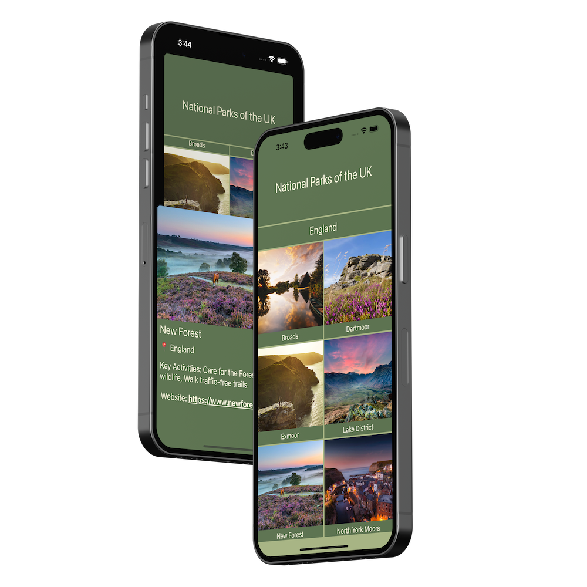

# National Parks of the UK

## Description

This app is a comprehensive guide to the national parks of the United Kingdom, offering detailed information and insights.

## Tech stack

Initially developed using UIKit, the app has undergone significant evolution in its second release. 

Key updates and enhancements include:
- Transition to SwiftUI for a more modern and responsive interface;
- Integration of existing UIKit views within the SwiftUI framework;
- Implementation of async/await alongside AsyncImage for enhanced performance and smoother image loading;
- A refreshed design that improves user interaction and visual appeal.

Technologies Utilized:
- **SwiftUI**: For building the user interface;
- **UIKit**: Integrated within SwiftUI for specific UI components;
- **Async/Await**: For efficient handling of asynchronous code, improving app responsiveness;
- **AsyncImage**: For optimized image loading and rendering;
- **JSONDecoder**: To parse and utilize data efficiently within the app.

## Preview

    

## License

[MIT](LICENSE)